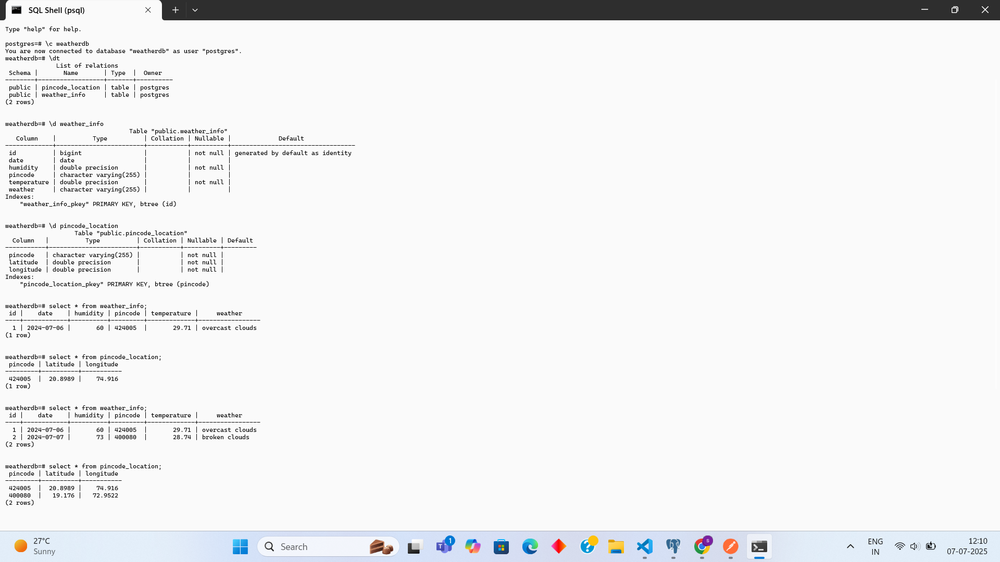
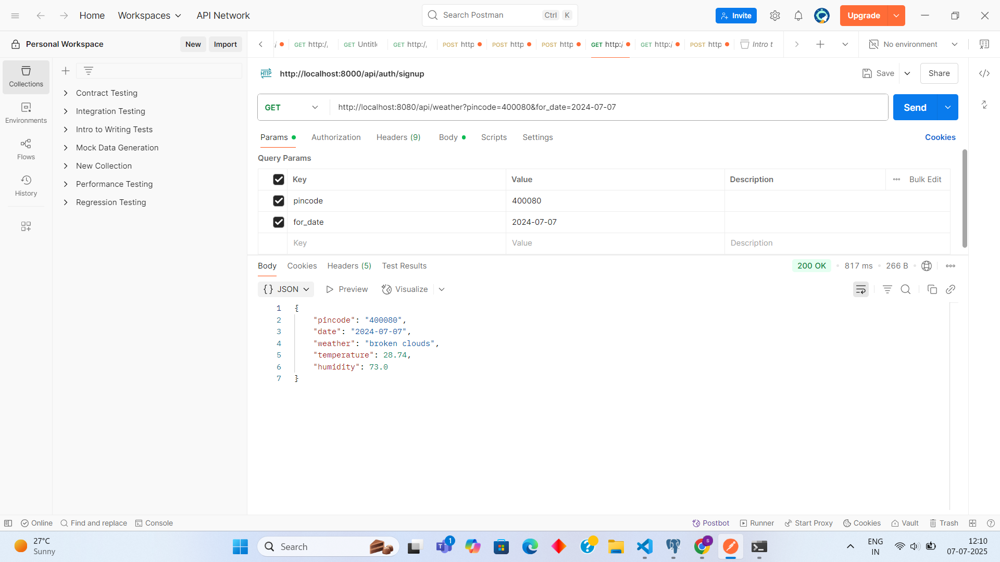

# 🌤️ Weather Info Backend API

This is a Spring Boot REST API that provides **weather information based on pincode and date** using the [OpenWeatherMap API](https://openweathermap.org/current). It stores weather data and geographical coordinates in a **PostgreSQL** database to avoid redundant API calls and improve performance.

---

## 📸 Project Architecture



---

## 🚀 Features

- ✅ Get weather info by `pincode` and `date`
- ✅ Avoid unnecessary external API calls using database caching
- ✅ Store latitude & longitude per pincode
- ✅ PostgreSQL database integration
- ✅ External API integration: OpenWeatherMap
- ✅ Error handling with meaningful HTTP responses
- ✅ Testable via Swagger or Postman

---

## 🧱 Technology Stack

| Layer           | Tech Used                         |
|-----------------|-----------------------------------|
| Backend         | Spring Boot (Java 17+)            |
| API Client      | RestTemplate                      |
| Database        | PostgreSQL                        |
| ORM             | Spring Data JPA                   |
| Testing         | JUnit + Mockito                   |
| Build Tool      | Maven                             |
| External APIs   | OpenWeatherMap Geocoding & Weather|

---

## 📦 Folder Structure

weather_report/
├── src/
│   ├── main/
│   │   ├── java/com/weather/weather_report/
│   │   │   ├── controller/
│   │   │   ├── dto/
│   │   │   ├── entity/
│   │   │   ├── exception/
│   │   │   ├── repository/
│   │   │   ├── service/
│   │   │   └── WeatherReportApplication.java
│   │   └── resources/
│   │       ├── application.properties
│   │       └── static/
│   └── test/
│       └── java/com/weather/weather_report/
├── images/
│   └── Weather_application_Postgres_schema.png
|   └── Weather_application_Postgres_schema.png
├── pom.xml
└── README.md

---

## 📥 Setup Instructions

### 1️⃣ Clone the Repository

git clone https://github.com/shreyash1231/Weather-Info.git
cd Weather-Info

---

### 2️⃣ Configure PostgreSQL

Create a database (e.g. `weatherdb`) and update your credentials in `application.properties`:

```properties
spring.datasource.url=jdbc:postgresql://localhost:5432/weatherdb
spring.datasource.username=postgres
spring.datasource.password=your_password
spring.jpa.hibernate.ddl-auto=update
openweather.api.key=API_KEY

### 3️⃣  Build and Run

./mvnw spring-boot:run

---

## 🧪 API Usage

### ✅ Endpoint

GET http://localhost:8080/api/weather?pincode=411014&for_date=2025-07-07

### 📥 Parameters

| Param      | Type     | Description                   |
|------------|----------|-------------------------------|
| `pincode`  | String   | Indian postal code            |
| `for_date` | ISO Date | Date format: `yyyy-MM-dd`     |

### 🔁 Sample Response

{
  "pincode": "411014",
  "date": "2025-07-07",
  "weather": "clear sky",
  "temperature": 28.5,
  "humidity": 62
}

---

## ⚠️ Error Handling

| Error         | HTTP Code | Message                       |
|---------------|-----------|-------------------------------|
| Invalid input | 400       | Missing or wrong pincode/date |
| API failure   | 500       | Weather/Geo API error         |
| Not found     | 404       | No data found in cache          |

---

## 🔬 Run Tests

./mvnw test

---

## 🔗 API Reference

- 🌐 OpenWeatherMap Docs: https://openweathermap.org/api
- 📍 Geo API: https://openweathermap.org/api/geocoding-api

---

Shreyash Chandwadkar

- 🌐 LinkedIn: https://www.linkedin.com/in/shreyash-chandwadkar
- 💻 GitHub: https://github.com/shreyash1231

---
